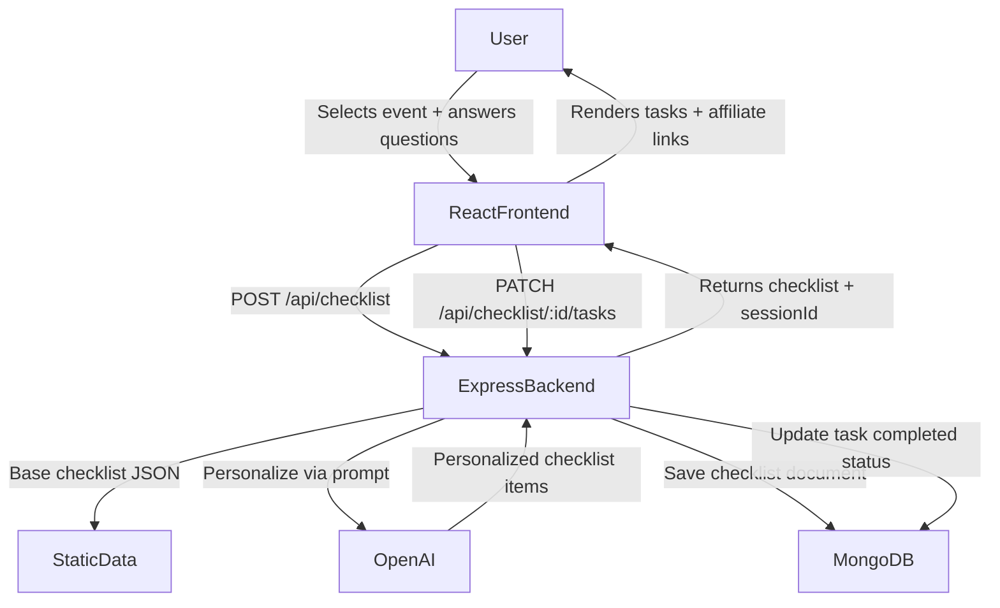

# Life Event Checklist Generator

## Architecture




## Tech Stack

- **Frontend**: React + Vite + Tailwind CSS
- **Backend**: Node.js + Express
- **AI**: OpenAI API (`gpt-4o-mini` — cheap and fast)
- **Data**: Static JSON files for base checklists per event type
- **Storage**: `localStorage` (free tier), MongoDB + Mongoose + user accounts (paid tier, later)

## Project Structure

```
/
├── client/                        # React app (Vite)
│   ├── src/
│   │   ├── pages/
│   │   │   ├── Home.jsx           # Event selection grid
│   │   │   ├── Questions.jsx      # Short questionnaire per event
│   │   │   ├── Checklist.jsx      # Interactive checklist view
│   │   │   ├── ChecklistDetail.jsx# Resume a specific past checklist
│   │   │   ├── History.jsx        # All past checklists with progress %
│   │   │   ├── Settings.jsx       # Preferences, account info
│   │   │   ├── Login.jsx          # Login form
│   │   │   ├── Register.jsx       # Registration form
│   │   │   ├── About.jsx          # What the app is, how it works (SEO)
│   │   │   └── NotFound.jsx       # 404 fallback page
│   │   ├── components/
│   │   │   ├── layout/
│   │   │   │   ├── Navbar.jsx     # Top nav with logo, history, settings links
│   │   │   │   └── Footer.jsx     # Links, legal, affiliate disclosure
│   │   │   ├── ui/
│   │   │   │   ├── Modal.jsx      # Reusable confirm/info dialog
│   │   │   │   ├── Toast.jsx      # Success/error notifications
│   │   │   │   └── Loader.jsx     # Spinner for AI generation wait
│   │   │   ├── EventCard.jsx      # Card for each life event on Home
│   │   │   ├── ChecklistItem.jsx  # Task row + affiliate link badge
│   │   │   ├── ProgressBar.jsx    # Linear progress bar inside checklist
│   │   │   └── ProgressRing.jsx   # Circular % ring for History cards
│   │   ├── hooks/
│   │   │   ├── useChecklist.js    # Fetch, update, persist checklist state
│   │   │   └── useSession.js      # Manage anonymous sessionId in localStorage
│   │   ├── context/
│   │   │   └── AuthContext.jsx    # Global auth state (logged-in user)
│   │   ├── lib/
│   │   │   └── affiliateLinks.js  # affiliateCategory → URL mapping
│   │   └── App.jsx                # React Router routes
├── server/                        # Express API
│   ├── routes/
│   │   ├── checklist.js           # POST /api/checklist, PATCH /api/checklist/:id/tasks
│   │   ├── history.js             # GET /api/history (by sessionId or userId)
│   │   └── auth.js                # POST /api/auth/register, /login, /logout
│   ├── middleware/
│   │   └── authMiddleware.js      # JWT verify for protected routes
│   ├── data/
│   │   ├── newBaby.json
│   │   ├── boughtHouse.json
│   │   ├── newJob.json
│   │   ├── movedCity.json
│   │   └── gotMarried.json
│   ├── models/
│   │   ├── User.js                # Mongoose user schema
│   │   └── Checklist.js           # Mongoose checklist schema (tasks + progress)
│   ├── db.js                      # MongoDB connection via Mongoose
│   └── services/
│       └── openai.js              # Personalization prompt logic
└── .env                           # OPENAI_API_KEY, MONGODB_URI, JWT_SECRET
```

## User Flow

1. **Home** — grid of life event cards
2. **Questions** — 3-5 short questions tailored to the event
3. **Checklist** — personalized, ordered task list; check off tasks; affiliate link badges on relevant items
4. **History** — list of all past checklists with a progress ring showing % complete; click any to resume
5. **Settings** — toggle notification preferences, manage account, delete data
6. **Login / Register** — optional; unlocks cross-device sync and saved history

## API Routes


| Method  | Route                      | Purpose                                    |
| ------- | -------------------------- | ------------------------------------------ |
| `POST`  | `/api/checklist`           | Generate + save new checklist              |
| `PATCH` | `/api/checklist/:id/tasks` | Mark task complete/incomplete              |
| `GET`   | `/api/history`             | Fetch all checklists for a session or user |
| `GET`   | `/api/checklist/:id`       | Fetch a single saved checklist             |
| `POST`  | `/api/auth/register`       | Create account                             |
| `POST`  | `/api/auth/login`          | Login, returns JWT                         |
| `POST`  | `/api/auth/logout`         | Invalidate session                         |


## UI/UX Design

### Design Direction

Clean, calming, trustworthy. People come to this app during stressful life moments — the UI should feel like a calm, organized friend, not a cluttered tool.

- **Style**: Minimal, modern, generous white space
- **Colors**: Soft primary (indigo or teal) + neutral grays + gentle accent color for affiliate badges
- **Typography**: One clean sans-serif (Inter), clear size hierarchy
- **Tone of microcopy**: Warm and supportive ("You're on track!", "Almost done!", "3 tasks left!")

### Page-by-Page Design

**Home**

- Hero section at top: short headline ("Life just changed? We'll help you handle it.") + subtext
- Below: grid of 5-6 event cards, each with an icon, title, and short tagline
- Cards have subtle hover lift/shadow to feel clickable
- No sign-up required — zero friction to start

**Questions**

- One question at a time (not a long form) — feels conversational, not overwhelming
- Big pill-shaped buttons for answers (not dropdowns)
- Progress dots at top showing "question 2 of 4"
- Back button to change a previous answer
- Smooth animated transitions between questions

**Checklist (core screen)**

- Category headers grouping related tasks (e.g. "Security", "Finance", "Admin")
- Each task row: checkbox + title + expandable description underneath
- Affiliate tasks show a subtle colored badge ("Find a provider →") — helpful, not aggressive
- Sticky progress bar at the top showing overall % complete
- Confetti or subtle animation when hitting 100%
- "Share this checklist" button (copy link or export PDF)

**History**

- Card per past checklist: event icon, event name, date created, circular progress ring
- Sorted by most recent first
- Click any card to resume that checklist
- Empty state: illustration + "Start your first checklist!" link back to Home

**Settings**

- Simple vertical list: notification preferences, account info, delete my data
- Minimal — nothing complex

**Login / Register**

- Minimal centered form: email + password
- Clear reason shown: "Create an account to save your progress across devices"
- Social login (Google) added later

### Key UX Principles


| Principle                    | Implementation                                                 |
| ---------------------------- | -------------------------------------------------------------- |
| Zero friction to start       | No sign-up; jump straight to event selection                   |
| One thing at a time          | Questions page shows one question, not a form wall             |
| Progress is always visible   | Dots on questions, bar on checklist, rings on history          |
| Encouragement                | Microcopy celebrates progress at milestones                    |
| Affiliate links feel helpful | Phrased as "Find a provider" with subtle badge, not banner ads |
| Mobile-first                 | Designed for phone use during chaotic life moments             |
| Accessible                   | Good contrast ratios, keyboard navigation, proper ARIA labels  |


### Mobile Layout

- Bottom tab bar: Home, History, Settings
- Checklist items are large tap targets (minimum 44px height)
- Sticky header with event name + progress bar
- Optional: swipe right to complete a task

### Color Palette (suggested)


| Role             | Color                   | Usage                             |
| ---------------- | ----------------------- | --------------------------------- |
| Primary          | Indigo 600 (`#4F46E5`)  | Buttons, links, active states     |
| Primary light    | Indigo 50 (`#EEF2FF`)   | Card backgrounds, hover states    |
| Success          | Emerald 500 (`#10B981`) | Completed tasks, progress bars    |
| Affiliate accent | Amber 500 (`#F59E0B`)   | Affiliate badges                  |
| Text             | Gray 900 / Gray 500     | Headings / body text              |
| Background       | White / Gray 50         | Page background / card background |


## How AI Personalization Works

The backend sends OpenAI a prompt like:

> "Generate a prioritized checklist for someone who just bought a house. It is their first home, they have a mortgage, no kids. Return JSON array of tasks with: title, description, category, affiliateCategory (or null)."

OpenAI returns structured JSON, which is merged with the static base checklist (static = always reliable, AI = adds personal context).

## Monetization (built-in from day 1)

Each checklist item has an optional `affiliateCategory` field (e.g. `"life-insurance"`, `"moving-company"`, `"529-plan"`). The frontend maps these to real affiliate links. No manual work per item — the category mapping drives it all.

## V1 Scope (what to build first)

- 5 life events with base JSON checklists
- Questions page (3-5 questions per event)
- AI personalization via OpenAI
- Interactive checklist with progress saved to `localStorage`
- Affiliate links on relevant tasks
- Clean, mobile-friendly UI

## MongoDB Data Model

**Checklist document** (saved when a user completes the questionnaire):

```js
{
  _id: ObjectId,
  sessionId: String,       // anonymous ID stored in localStorage (free tier)
  userId: ObjectId,        // optional, linked when user creates account
  eventType: String,       // e.g. "boughtHouse"
  answers: Object,         // questionnaire answers
  tasks: [
    {
      title: String,
      description: String,
      category: String,
      affiliateCategory: String | null,
      completed: Boolean,
      completedAt: Date | null
    }
  ],
  createdAt: Date,
  updatedAt: Date
}
```

Free-tier users are identified by a `sessionId` (UUID stored in `localStorage`). When they create an account later, their saved checklists are migrated by linking `userId`.

## V2 (after launch)

- User accounts to save/resume checklists across devices
- Email reminders for upcoming tasks
- More life events
- Freemium paywall for advanced events

